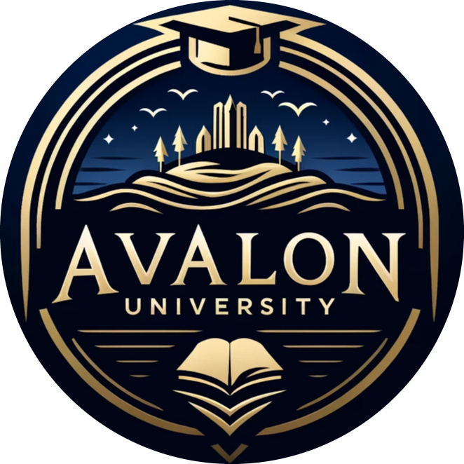
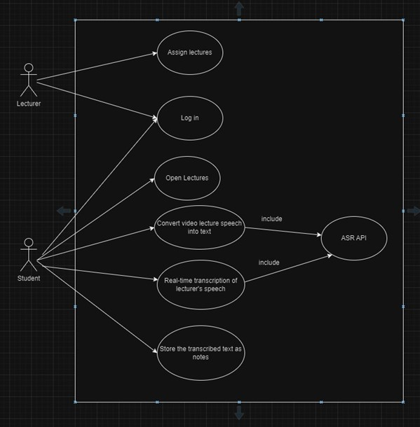
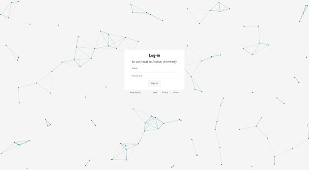
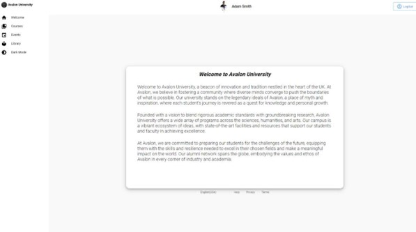
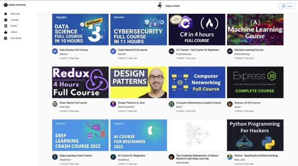
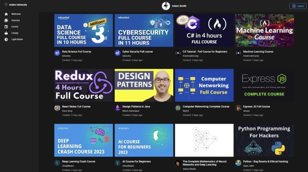
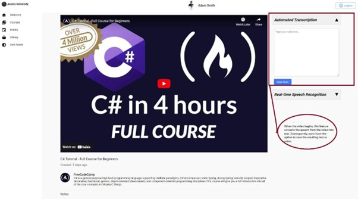
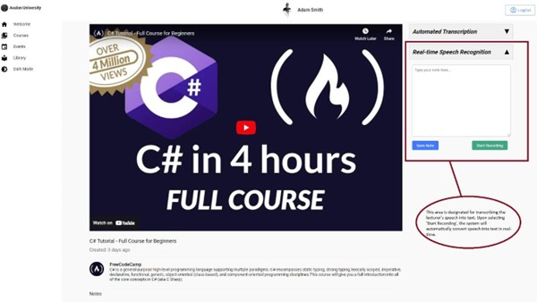

# Avalon University


## Table of Content
- [Description](#description)
- [Installation](#installation)
- [Usage](#usage)
- [Result](#result)
- [Acknowledgements](#acknowledgements)

## Description
This project encapsulates the development and evaluation of an Academic Support System
designed to improve accessibility for students, particularly those with disabilities and
international students. The system leverages advanced technologies, including Artificial
Intelligence (AI) and Natural Language Processing (NLP), centred around a robust
Automatic Speech Recognition (ASR) model developed using the Kaldi toolkit. This model is
integral to the system's capability to offer real-time lecture transcription, which enables all
students to access and engage with lecture content more effectively. The necessity for this
system stems from the challenges that traditional learning materials present to students who
face barriers due to physical disabilities or language differences. By transforming spoken
lectures into text in real-time, the system not only aids in comprehension during lectures but
also enhances students' ability to review and interact with educational content at their own
pace. Significant efforts were put into ensuring that the system is user-friendly and
integrative, employing the MERN stack to create a seamless digital platform for users. This
platform supports the ASR tool and simplifies access to educational materials,
demonstrating a potentially significant impact on educational outcomes across a diverse
student.

This repository contains two main components developed on the Ubuntu operating system:
1. 'Project' Folder: This folder includes the code for a web application developed using the MERN stack (MongoDB, Express.js, React, and Node.js).
2. 'ModelEvaluation.ipynb' Notebook: A Jupyter Notebook that focuses on the evaluation and testing of an Automatic Speech Recognition (ASR) model using the KALDI toolkit and the TIMIT dataset.


## Installation
To install and run the MERN stack application, follow these steps:
1. Clone the repository:
```
$ git clone https://github.com/AnassBoufangara/AvalonUniversity.git
$ cd AvalonUniversity
```

2. Install the server dependencies:
```
$ cd BackEnd
$ npm install
```

3. Install the client dependencies:
```
$ cd ../FrontEnd 
$ npm install
```


## Usage:
To start the application, run the following commands:
1. Start the backend server:
```
$ cd BackEnd
$ npm start
```

2. Start the frontend server:
```
$ cd ../FrontEnd
$ npm start
```

The application should now be running at `http://localhost:3000`.


## Result:
Use case digarm:



Here are some screenshots of the website:
* Login page:



* Welcome page:



* Home Page:



* Includes support for dark mode:



* Lecture page:


* 'Automated Transcription' Component:
The image shows the interface of Avalon University's online learning platform, specifically highlighting the "Automated Transcription" feature adjacent to a selected video course titled "C# Tutorial - Full Course for Beginners." This section is designed to enhance the learning experience by providing real-time transcription of video lectures. As the video plays, the speech content is automatically converted into text within the "Automated Transcription" box, allowing students to follow along with a written version of the lecture. This text can be edited and saved as notes directly from the interface, facilitating efficient study and review. This feature is particularly beneficial for students who may prefer reading to auditory learning or those who require written materials to complement their learning process. 



* 'Real-Time Speech Recognition' Component:
In the depicted interface of the Avalon University platform, the 'Real-Time Speech Recognition' feature is a key component designed to enhance the accessibility and usability of educational content for students. This functionality is particularly beneficial for auditory learners and those who may face challenges in following verbal instructions or lectures due to disabilities or language barriers. When a user selects "Start Recording," the system initiates an automated transcription process that converts spoken words from the video into written text, displaying the results in real time within the adjacent text box. This allows students to interactively engage with the lecture content, facilitating immediate comprehension and note-taking



* Notes section:
In the interface of Avalon University's educational platform, the "Notes" section serves a dual functionality, the notes saved as two different types: "Video" and "Speech". These categories represent the origins of the transcription. "Video" notes are generated through the "Automated Transcription" feature, where the textual output is derived from pre-recorded video lectures. This enables students to access lecture content in text format that is automatically transcribed as the video plays. Conversely, "Speech" notes originate from the "Real-Time Speech Recognition" feature, designed to convert spoken words into text during live sessions or streaming lectures. This real-time transcription aids students in capturing verbal communications instantly, thus enhancing note-taking efficiency and accuracy. The integration of these two types of transcription processes within the platform significantly enriches the learning tools available to students, catering to diverse learning preferences and needs.


# Acknowledgements
I extend my heartfelt gratitude to my supervisors, Dr. Wei Li and Dr. Kimia Aksir, whose expertise and insightful guidance were instrumental in the conception and execution of this project. Their unwavering support and constructive feedback throughout this journey have been invaluable.
I am also immensely grateful to Dr. Charles Clarke, the responsible for the Final Year Project module, whose diligent coordination and dedication to the academic and professional development of students have greatly enhanced my research experience.